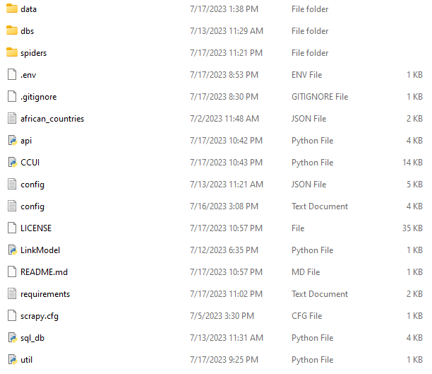
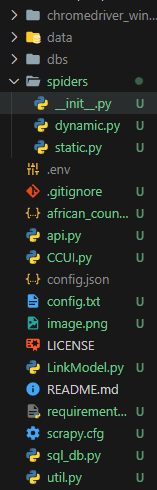
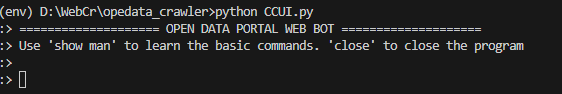
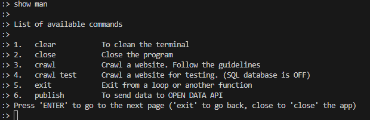

# Open Data Portal Web Crawler
This Python-based web crawler is designed to collect links and gather data from websites using various methods. It employs crawling and scraping techniques to extract information from webpages.

# Documentation

## Installation


1. Clone The repository
    ```bash 
    git clone https://github.com/Application-Data-Platform-CMU-Africa/web_crawler.git
    ```

2. Create a virtual environment and activate it (This is for windows platform) - optional
    ```bash
       python -m venv env
       python env\script\activate 
    ```
3. Install dependencies
    ```bash
       pip install -r requirements.txt
    ```
4. Create a configuration file, refer to the config.txt file

5. Create a /data forlder

6. create a dbs folder

7. Create a .env file, refer to env.sample.txt file





***NB: The dynamic spider is still under developmeent; therefore, there is no need to install chromedriver for now*** 

## Usage

This software is a Command line User Interface (CUI).
To start it execute the following python script

```bash
   python CCUI.py
```


This will display CUI and the CUI has a user manual
To access the user manual type in the following script
```bash
:> show man
```


### !!! Be careful when executing the ```:> publish ``` Command !!!
